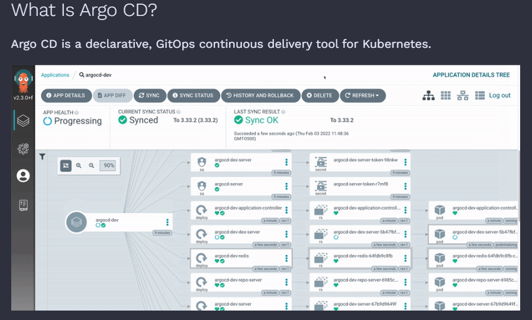
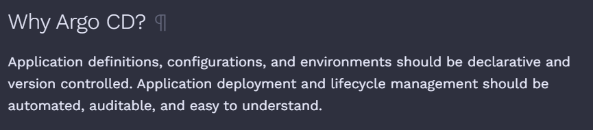
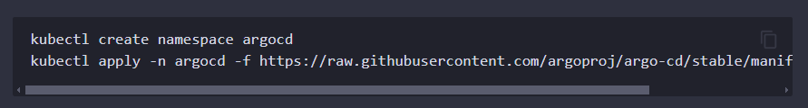
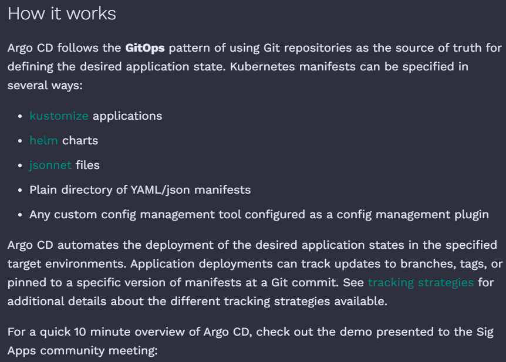
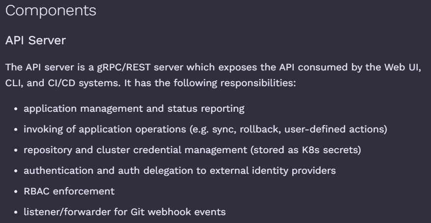
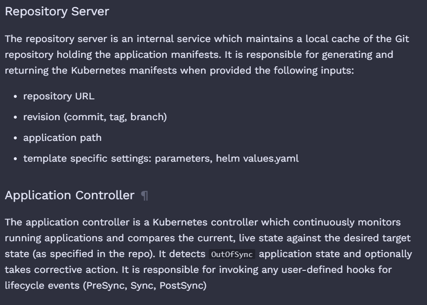

* Overview
Argo CD is a declarative continuous delivery tool for Kubernetes. It can be used as a standalone tool or as a part of your CI/CD workflow to deliver needed resources to your clusters.

In order to manage infrastructure and application configurations aligned with GitOps, your Git repository must be the single source of truth. The desired state of your system should be versioned, expressed declaratively, and pulled automatically. This is where Argo CD comes in. 

* Why use Argo CD with OpenShift?
Specifically with Red Hat® OpenShift®, Argo CD can be implemented to deliver global custom resources from a Git repository (your source of truth) to your OpenShift clusters. These resources can contain application definitions, configurations, and target states for your environments, which can also be version controlled with Argo CD.

Using Argo CD to continuously deliver these resources can ensure that your applications do not fall out of sync with your desired states. 

In an example architecture, Argo CD acts as the application controller that continuously checks between the Git repository and the applications for parameters defined by the cluster admin. 

* How Argo CD keeps applications on track ?
Should an application meet criteria for any user-defined hooks for lifecycle events (PreSync, Sync, PostSync), Argo CD can optionally issue corrective actions, depending on how it is configured. This is just one of the many different use cases that Argo CD can be applied to. Other options include:

* Sync with Secret Manager
  Keep OpenShift secrets in sync with a secret manager like Vault.
* Detect configuration drift
  Have OpenShift GitOps detect and display a warning when cluster configurations are not in sync with the designated Git repository.
* Multiple clusters in one registry
  Define multiple OpenShift cluster configurations in a single Git repository and apply to clusters selectively, so that all cluster configurations are coming from a single source of truth.
* Cluster configuration hierarchy (inheritance)
   Define a hierarchy of cluster configurations (stage, production, app portfolio, etc. with inheritance) in a Git repository, so that configurations can be applied to a single or multiple Kubernetes clusters.
* Templating and overriding configurations
   Override a subset of inherited configurations and their values, so that the configuration can be adjusted for the specific clusters they are being applied to.
 

